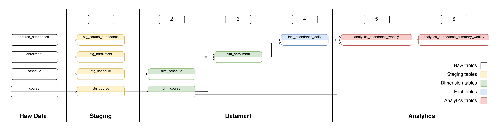

# AgriAku Data Engineer Test Answer



This repository contains my answer for AgriAku Data Engineer application test.

# Setup and running on host machine

Tested on:
```
MANJARO LINUX 6.1.99-1
Python 3.12.4
pip 24.0 from
```

## Preparing the environment

1. Clone this repository to your local machine and `cd` into it.
```bash
$ git clone https://github.com/perfect-less/agriaku-de-test
$ cd agriaku-de-test
```

2. Create a new virtual environment. I did mine using python's `venv` although `conda` should also work just fine, although please remember to also install pip in your conda's virtual environment since we will install the dependencies using `pip`.
```bash
$ python3 -m venv venv
```

3. Activate the newly created virtual environment.
```bash
$ source venv/bin/activate
```

5. Install dependencies using `pip`
```bash
$ pip3 install -r requirements.txt
```


## Input dataset

Input dataset should be put in `raw-data` directory in the root of the cloned repository. You can adjust the source data path in `pipeline_conf.yml` if you want to ingest data from somewhere else. But by default, the pipeline will expect to find the data inside `raw-data/`. The project structure should look like this.
```bash
.
├── raw-data
│   ├── course_attendance.csv
│   ├── course.csv
│   ├── enrollment.csv
│   └── schedule.csv
├── docker/
├── pipeline/
├── venv/
├── pipeline_conf.yml
├── README.md
├── LICENSE
├── requirements.txt
└── run_pipeline.py
```


## Running the pipeline

Please make sure that you are inside the repository and have already activate the environment before running the pipeline. Setup and installation step can be found above.

To run the pipeline just use the following command.
```bash
$ python3 run_pipeline.py
```

The warehouse tables can be found inside `warehouse/` directory while the final csv can be found inside `extracted-data/`
```bash
.
├── raw-data
│   ├── course_attendance.csv
│   ├── course.csv
│   ├── enrollment.csv
│   └── schedule.csv
├── docker/
├── pipeline/
├── venv/
├── pipeline_conf.yml
├── README.md
├── LICENSE
├── requirements.txt
├── run_pipeline.py
├── exported-data
│   ├── analytics_attendance_summary_weekly.csv
│   ├── analytics_attendance_weekly.csv
│   ├── dim_course.csv
│   ├── dim_enrollment.csv
│   ├── dim_schedule.csv
│   └── fact_attendance_daily.csv
└── warehouse
    ├── analytics
    │   ├── analytics_attendance_summary_weekly.parquet
    │   └── analytics_attendance_weekly.parquet
    ├── datamart
    │   ├── dim_course.parquet
    │   ├── dim_enrollment.parquet
    │   ├── dim_schedule.parquet
    │   └── fact_attendance_daily.parquet
    └── staging
        ├── stg_course_attendance.parquet
        ├── stg_course.parquet
        ├── stg_enrollment.parquet
        └── stg_schedule.parquet

```


# Running in docker

Before running with docker, please make sure that the datasets is inside `raw-data/` directory like in the following directory tree.
```bash
.
├── raw-data
│   ├── course_attendance.csv
│   ├── course.csv
│   ├── enrollment.csv
│   └── schedule.csv
├── docker/
├── pipeline/
├── venv/
├── pipeline_conf.yml
├── README.md
├── LICENSE
├── requirements.txt
└── run_pipeline.py
```
Unlike with running the pipeline in host, when running with the docker scripts, it will expect the source datasets to be located in `raw-data/` directory. 

The next part is to build the image. Please make sure that you are in the root of the repository. This step is very simple and can be done using already prepared script.
```bash
$ ./docker/build-docker.sh
```

To run the pipeline, just use the run script.
```bash
$ ./docker/run-docker.sh
```

You should be able to found the results inside `docker_volume/` directory that have been created by the run script.
```bash
.
├── raw-data
│   ├── course_attendance.csv
│   ├── course.csv
│   ├── enrollment.csv
│   └── schedule.csv
docker_volume/
├── exported-data
│   ├── analytics_attendance_summary_weekly.csv
│   ├── analytics_attendance_weekly.csv
│   ├── dim_course.csv
│   ├── dim_enrollment.csv
│   ├── dim_schedule.csv
│   └── fact_attendance_daily.csv
├── raw-data
│   ├── course_attendance.csv
│   ├── course.csv
│   ├── enrollment.csv
│   └── schedule.csv
└── warehouse
    ├── analytics
    │   ├── analytics_attendance_summary_weekly.parquet
    │   └── analytics_attendance_weekly.parquet
    ├── datamart
    │   ├── dim_course.parquet
    │   ├── dim_enrollment.parquet
    │   ├── dim_schedule.parquet
    │   └── fact_attendance_daily.parquet
    └── staging
        ├── stg_course_attendance.parquet
        ├── stg_course.parquet
        ├── stg_enrollment.parquet
        └── stg_schedule.parquet
├── docker/
├── pipeline/
├── venv/
├── pipeline_conf.yml
├── README.md
├── LICENSE
├── requirements.txt
└── run_pipeline.py
```
